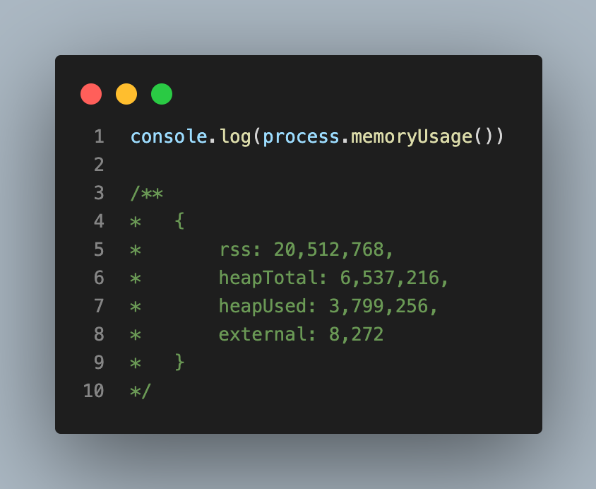
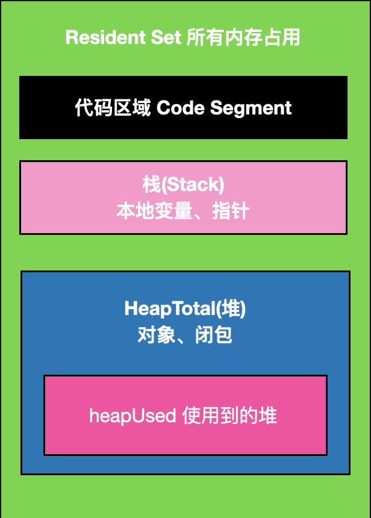
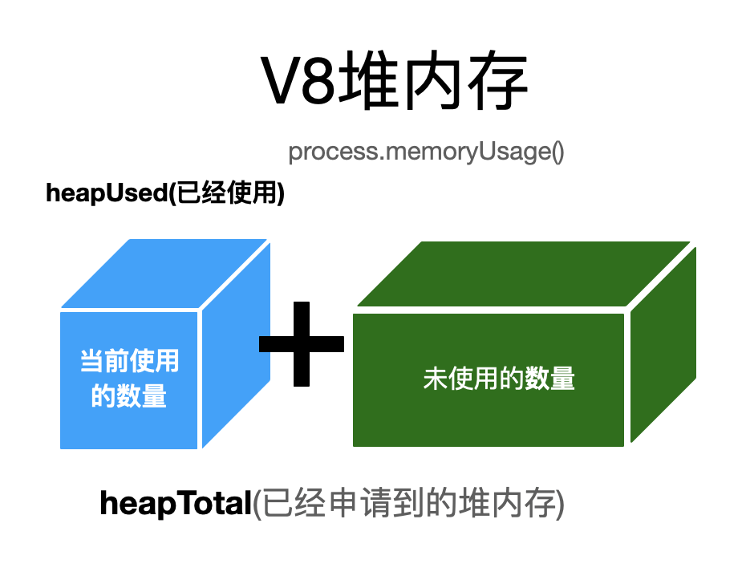

# JavaScript中的垃圾收集

+ 程序的运行需要内存，只要程序要求，操作系统就必须提供内存

+ JavaScript使用自动内存管理，这被称为“垃圾回收机制”（garbage collector）

+ 优点是可以简化开发、节省代码

+ 缺点是无法完整的掌握内存的分配与回收的具体过程

## NodeJS中的内存管理

+ 网页端的内存泄漏

+ 对于持续运行的服务进程Node服务器端程序，必须及时释放不再用到的内存。否则内存使用越来越高，轻则影响系统性能，重则导致进程崩溃

+ 如果不在用到的内存没有及时释放。就叫做内存泄漏

## V8内存管理

### v8内存限制

+ 在64位操作系统可以使用1400m内存

+ 在32位操作系统可以使用700m内存

### v8内存管理

+ JS对象都是通过V8进行分配管理内存的

+ ```process.memoryUsage```返回一个对象，包含了Node进程的内存占用信息



- rss(resident set size)：所有内存占用，包括指令区和堆栈。

- heapTotal：“堆”占用的内存，包括用到的和没用到的

- heapUsed：用到的堆的部分（判断内存泄漏，以heapUsed字段为准）

- external：V8引擎内部的C++对象占用的内存





### 为何限制内存大小

- 因为V8的垃圾收集工作原理导致的，1.4G内存完全一次垃圾收集需要1秒以上

- 这个暂停时间称为 Stop The World，在这个期间，应用的性能和响应能力都会下降

### 如果打开内存限制

- 一旦初始化成功。生效后不能再修改

- -max-new-space-size,最大new space大小，执行scavenge回收，默认16M，单位KB

- -max-old-space-size,最大old space大小，执行MarkSweep回收，默认1G，单位MB