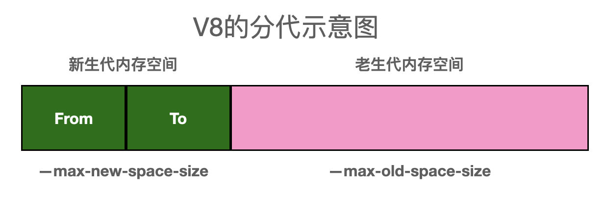
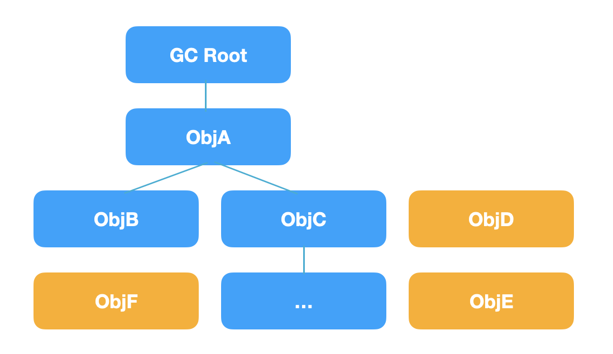
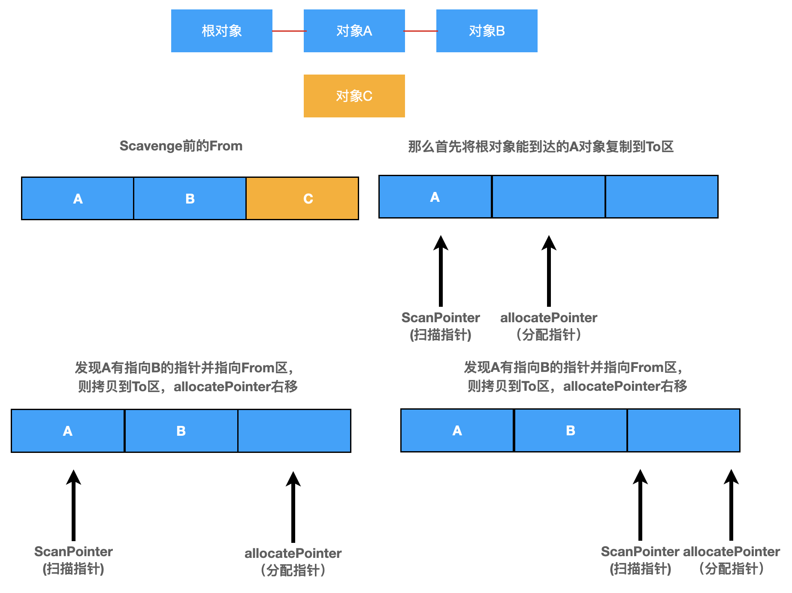
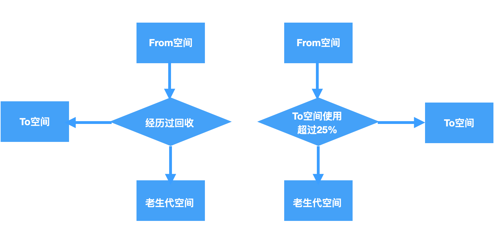
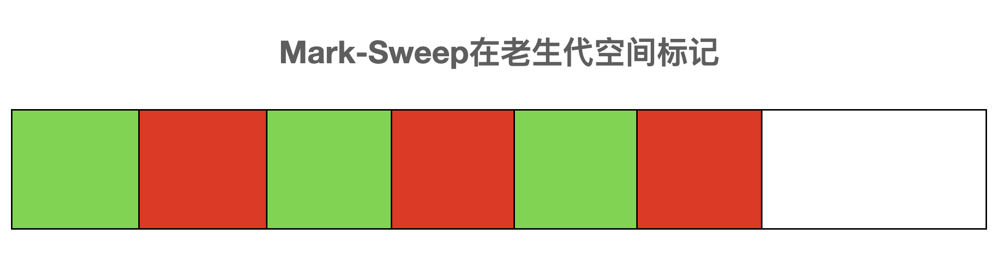
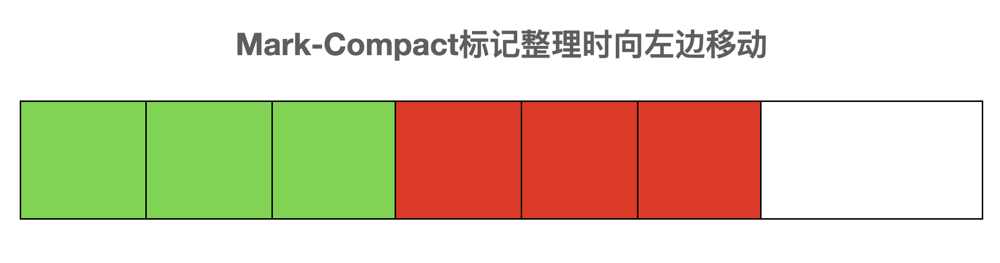
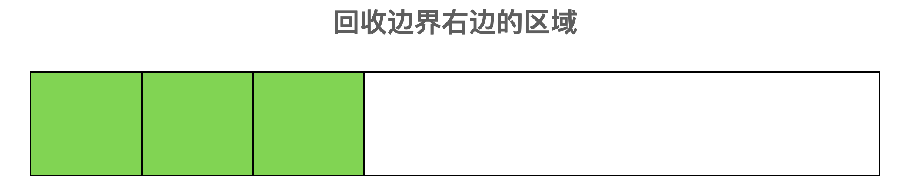
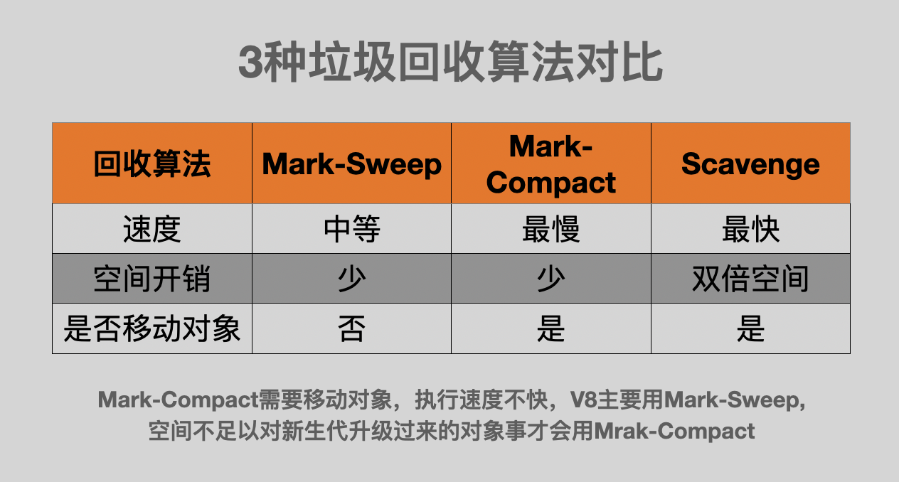

# V8 的垃圾回收机制

- v8 是基于分代的垃圾回收

- 不同代垃圾回收机制不一样

- 按存活时间分为新生代和老生代

## 分代

- 年龄小的是新生代，由 From 区域和 To 区域两个区域组成

    - 在64位系统里，新生代内存是32M，From区域和To区域个占用16M
    - 在32位系统里，新生代内存是16M，From区域和To区域各占用8M

- 年龄大的是老生代，默认情况下： - 64 位系统下老生代内存是 1400M - 32 位系统下老生代内存是 700M



## 新生代垃圾回收

- 新生代区域一分为二，每个 16M，一个使用，一个空闲

- 开始垃圾回收的时候，会检查 FROM 区域中的存活对象，如果还活着，拷贝到 TO 空间，完成后释放空间

- 完成后 FROM 和 TO 互换

- 新生代扫描的时候是一种广度优先的扫描策略

- 新生代的空间小，存活对象少

- 当一个对象经历多次的垃圾回收依然存活的时候，生存周期比较长的对象会被移动到老生代，这个移动的过程被称为晋升或者升级

    - 经历5次以上的回收还存在
    - TO的空间使用占比超过25%，或者超大对象

怎么判断一个对象是否是存活对象呢？

## 引用计数

- 语言引擎有一张引用表，保存了内存里面所有的资源的引用次数。

- 若果一个值的引用次数是 0，就表示这个值不再用到了，因此可以将这块内存释放。



```js
function Person(name) {
  this.name = name
}
const p1 = new Person('youpin1')
const p2 = new Person('youpin2')
```

```js
function Person(name) {
  this.name = name
}
let s = new Set()
let p = new Person('youpin')
s.add(p)
p = null
s = null
```

新生代回收流程


升级流程


## 老生代

- mark-sweep(标记清除) mark-compact(标记整理)

- 老生代空间大，大部分都是存活对象，GC耗时比较长

- 在GC期间无法响应，STOP-THE-WORLD

- V8 有一个优化方案，增量处理，把一个大暂停换成多个小暂停 INCREMENT-GC







### mark-sweep(标记清除)

- 标记活着的对象，随后清除在标记阶段没有标记的对象，只清理死亡对象

- 问题在于清除后会出现内存不连续的情况，这种内存碎片会对后续的内存分配产生影响

- 如果要分配一个大对象，碎片空间可能无法分配

### mark-compack(标记整理)

- 标记死亡后会对对象进行整理，活着的对象向左移动，移动完成后直接清理掉边界外的内存

### incremental marking 增量标记

- 以上三种回收时都需要暂停程序执行，收集完成后才恢复，STOP-THE-WORLD在新生代影响不大，但是在老生代影响就非常大了

- 增量标记就是把标记改为了增量标记，把一次性长时间停顿拆分成了多个小步骤，做完一步程序运行一会儿，垃圾回收和应用程序运行交替进行，停顿时间可以减少到1/6左右,包括垃圾回收占用时间

